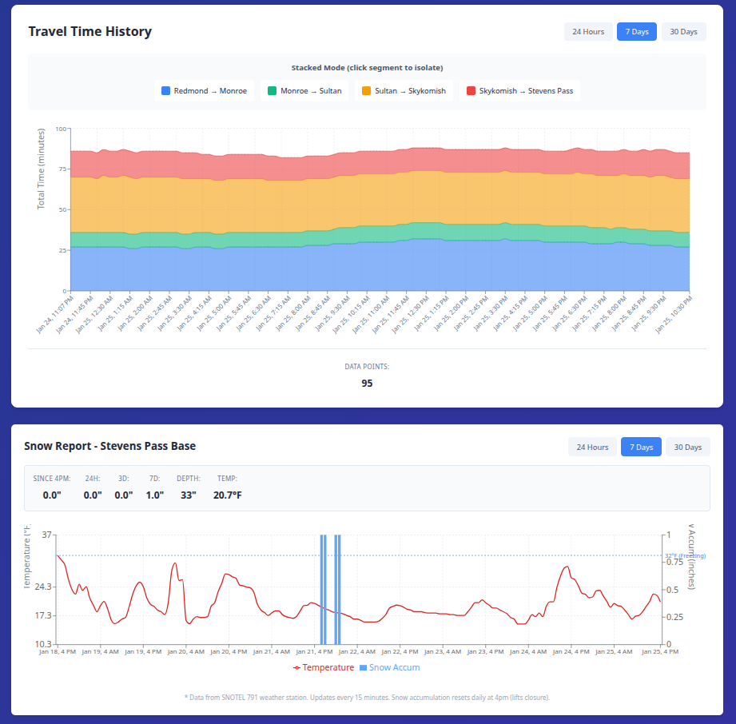

# Snow Traffic

Real-time and historical travel time data for Seattle ↔ Stevens Pass via US-2.



> **Note:** This is a vibe-coded project built with [Claude](https://claude.ai).

## Quick Start

### 1. Configure Environment

```bash
# Copy the example environment file
cp .env.example .env

# Edit .env and add your Google Maps API key
# Get your key from: https://console.cloud.google.com/apis/credentials
# Enable Routes API in your Google Cloud project
nano .env  # or use your preferred editor
```

**IMPORTANT**: Never commit your `.env` file or API key to git!

### 2. Set up the poller

```bash
cd poller
python -m venv venv
source venv/bin/activate  # On Windows: venv\Scripts\activate
pip install -r requirements.txt

# Initialize the database
python init_db.py

# Run the poller once to test
python poll_gmaps.py

# Set up cron for automated polling (every 15 minutes)
# Add to crontab: */15 * * * * cd /path/to/snowtraffic/poller && ./venv/bin/python poll_gmaps.py
```

### 2. Run the UI

```bash
cd ui
npm install
npm run dev
```

### 3. Run the API

```bash
cd api
python -m venv venv
source venv/bin/activate
pip install -r requirements.txt
uvicorn main:app --reload
```

### 4. Run Tests

```bash
cd api
source venv/bin/activate
pytest
```

## Architecture

- **Poller**: Python script that fetches Google Maps Routes API data every 15 minutes
- **Database**: SQLite for simple, local storage
- **API**: FastAPI for serving data to the UI
- **UI**: React SPA with Vite, Recharts for visualization

## Data Source

Google Maps Routes API: https://developers.google.com/maps/documentation/routes

API key required - get one from Google Cloud Console and enable Routes API.

## Development

### Running Tests

The API includes integration tests to ensure all endpoints work correctly:

```bash
cd api
source venv/bin/activate

# Run all tests
pytest

# Run with verbose output
pytest -v

# Run specific test file
pytest tests/test_api.py

# Run specific test class
pytest tests/test_api.py::TestCurrentStatusEndpoint

# Run specific test
pytest tests/test_api.py::TestCurrentStatusEndpoint::test_get_current_status_returns_list
```

### Environment Variables

The application uses environment variables for configuration:

- `GOOGLE_MAPS_API_KEY` - Your Google Maps API key (required)
- `DB_PATH` - Custom database path (optional)

You can set these in a `.env` file (see `.env.example`) or export them directly:

```bash
export GOOGLE_MAPS_API_KEY="your_key_here"
```

## Project Structure

```
snowtraffic/
├── poller/           # Data collection service
├── api/              # REST API backend
│   └── tests/       # Integration tests
├── ui/               # React frontend
├── data/             # SQLite database (generated)
└── .env.example      # Environment template
```

## License

MIT
